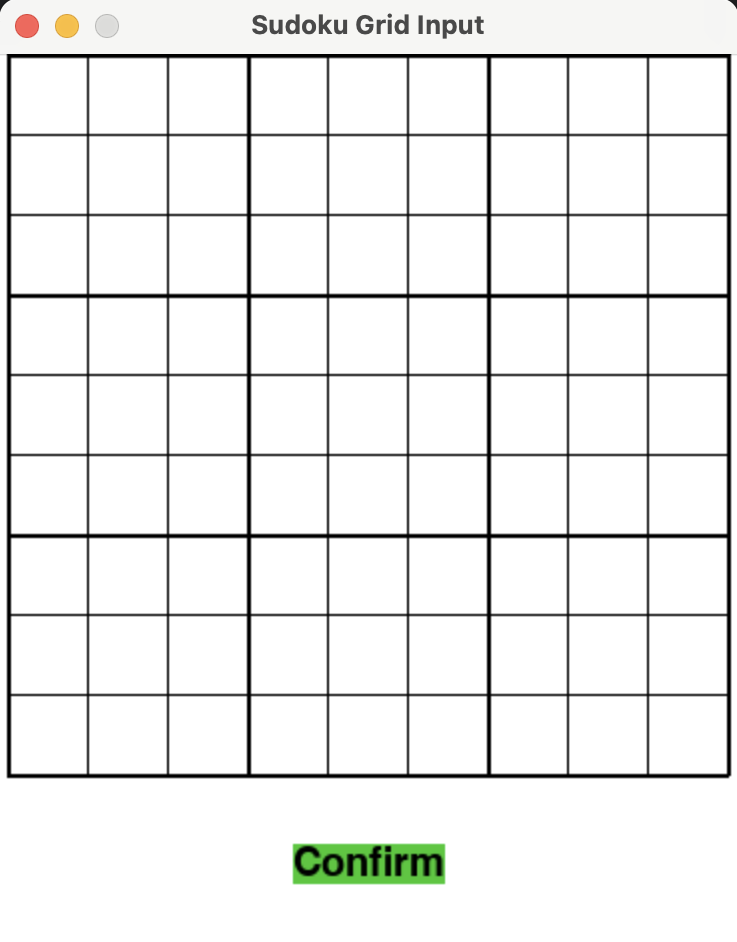
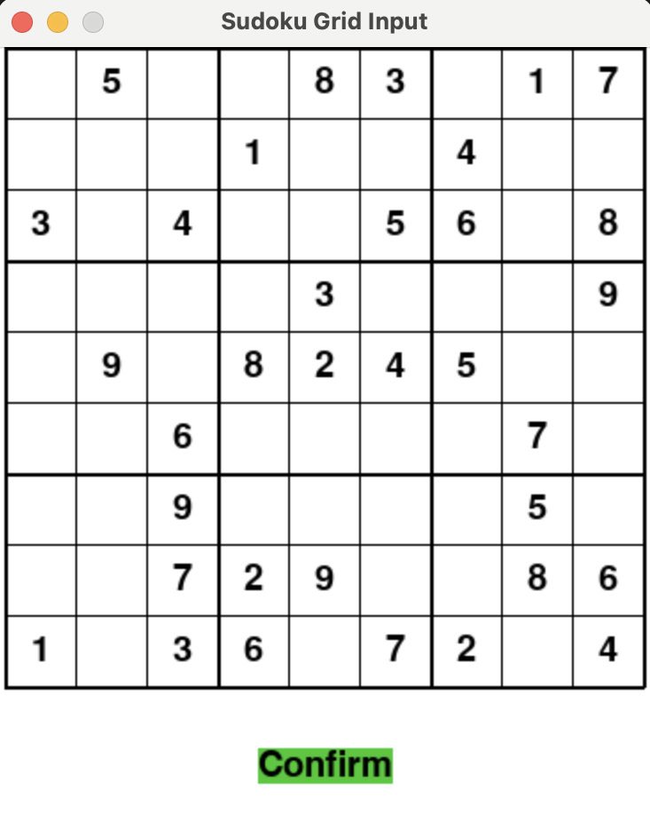
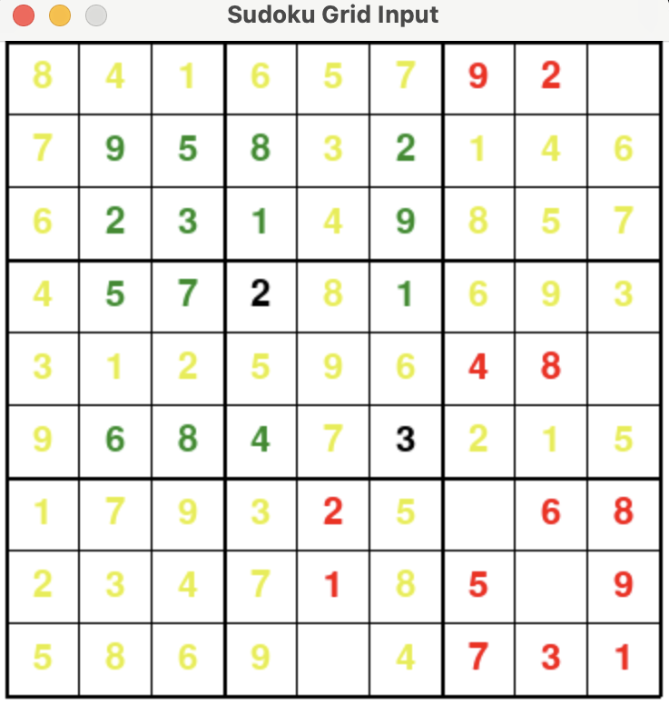
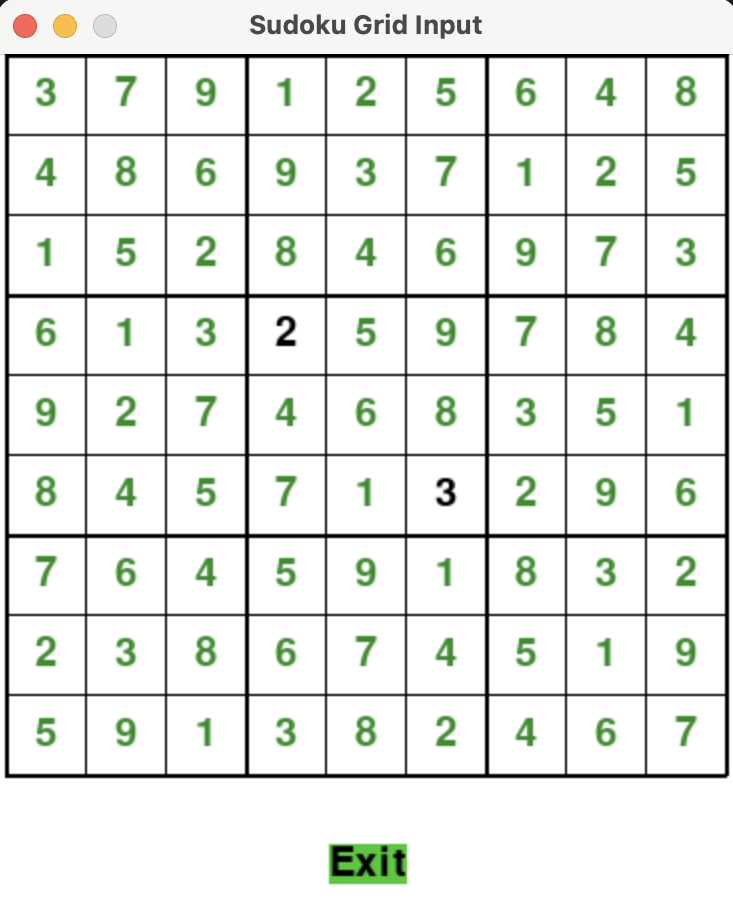

# Sudoku Solver using Ant Colony Optimization

## Table of Contents

- [Project Idea](#project-idea)
- [Method/Technique](#methodtechnique)
  - [Pheromone Management](#pheromone-management)
  - [Brief Algorithm Description](#brief-algorithm-description)
- [Dataset Explanation](#dataset-explanation)
- [Project Files Description](#file_description)
- [Installation](#installation)
- [User Interaction](#user_interaction)

## Project Idea

The goal of the project is to develop a Sudoku solver using the Ant Colony Optimization (ACO) algorithm. The solver will be capable of generating solutions for Sudoku puzzles of varying levels of complexity. The implementation of the ACO algorithm to solve Sudoku puzzles is a project that combines puzzle-solving techniques with bioinspired optimization.

## Method/Technique

The Ant Colony Optimization method was chosen to implement Sudoku problems.

### Pheromone Management

**Pheromone matrix:** 
A 2D array that represents the amount of pheromone associated with each possible value for each cell in the Sudoku grid. Initially, all cells have equal pheromone levels, typically set to  $\frac{1}{81}$, indicating an equal likelihood for any value to be chosen for any cell.

- **Global:**
  Updated periodically based on successful solutions to reinforce paths that lead to successful solutions.
- **Local:**
  At each step of ant exploration, local pheromone levels associated with the chosen value in the current cell are updated. This helps the ants choose various paths.

While the puzzle is not solved, during each iteration, ants sequentially traverse the Sudoku board, making one move per iteration. If a cell being explored is not fixed, the ant selects a value from its set of possible values, fixes it in the cell, and updates local pheromone levels. This reinforcement of successful choices aids subsequent ants in selecting promising values.

### Brief Algorithm Description

While puzzle is not solved, during each iteration, antssequentially traverse the Sudoku board, making one move per iteration. If a cell being explored is not fixed, the ant selects a value from its set of possible values, fixes it in the cell, and updates local pheromone levels. This reinforcement of successful choices aids subsequent ants in selecting promising values.

If a cell ends up with an empty set of possible values during exploration, it’s marked as incorrect. Each ant tracks the number of cells it has fixed, subtracting any incorrect cells encountered.

## Dataset Explanation

Our dataset will comprise various Sudoku puzzles that our program will have to solve. The link below leads to the code used for generating Sudoku puzzles. It produces a single string of numbers, where zeros represent empty spaces on the Sudoku grid with size (9 $\times$ 9). We will use this code to create 100 examples for our dataset ([accessible link](https://www.kaggle.com/datasets/bryanpark/sudoku)).
## Project Files Description <a name="file_description"></a>

- **data/input.txt**: This file contains the input data for the Sudoku Solver program from the user input.
- **data/one_sudoku.csv**: This file stores Sudoku puzzles in CSV format.
- **data/output.txt**: The output file where the solved Sudoku puzzle and best grids for every iteration are saved.
- **interface/CheckingConditions.py**: Python script for checking conditions within the Sudoku grid.
- **interface/CreatingCheckTable.py**: Script for creating a check table in the Sudoku grid.
- **interface/GridShowing.py**: Main file to run the Sudoku Solver program. Executes the graphical user interface for displaying the Sudoku grid.
- **src/Ant.py**: Python script defining the behavior of an ant in the Ant Colony Optimization algorithm.
- **src/AntColony.py**: Implementation of the Ant Colony Optimization algorithm for solving Sudoku puzzles.
- **src/SudokuGrid.py**: Module containing classes and functions for representing and manipulating the Sudoku grid.
- **src/Unit.py**: Definition of a cell in the Sudoku puzzle.
- **validation/test_results.txt**: Text file containing the results of validation tests.
- **venv/**: Directory containing the Python virtual environment for the project.
- **img/*.png**: images of user interface
- **README.md**: The README file providing information about the project, including installation instructions and file descriptions.

## Installation <a name="installation"></a>

To run the Sudoku Solver program locally, follow these steps:

1. **Clone the Repository**

    ```bash
    git clone https://github.com/Gamershmidt/Sudoku-solver-using-Ant-Colony-Optimization.git
    ```

2. **Navigate to the Project Directory**

    ```bash
    cd Sudoku-solver-using-Ant-Colony-Optimization
    ```

3. **Install Required Libraries**

    Make sure you have all the necessary libraries installed. You can install them using pip:

    ```bash
    pip install -r requirements.txt
    ```

4. **Run the Program**

    Navigate to the `interface` directory and execute the `GridShowing.py` file:

    ```bash
    cd interface
    python GridShowing.py
    ```
Ensure that the `GridShowing.py` file has executable permissions.

**Notes:**

- Make sure you have Python installed on your system.
- If you encounter any issues during installation or execution, refer to the troubleshooting section or raise an issue on the repository.


## User Interaction <a name="user_interaction"></a>

The Sudoku Solver features a user-friendly interface allowing users to initialize a Sudoku grid. Users can input fixed numerical values adhering to the game's specific constraints and rules. Input is facilitated by selecting a cell within the grid and entering a digit ranging from 1 to 9 inclusively. To remove a number from a cell, users input '0' or replace the existing digit with an alternate value.

<div align="center">
  
</div>

## Sudoku Rules

Sudoku is a combinatorial number-placement puzzle with stringent rules ensuring solution uniqueness and integrity. No two identical numbers can occupy the same row, column, or 3x3 subgrid simultaneously. The program prevents users from violating this cardinal rule, abstaining from displaying proposed changes that breach Sudoku constraints.
<div align="center">
  
</div>

## Solving Process

Upon configuring the Sudoku grid, users can confirm their input, initiating the solving process. The Sudoku puzzle is serialized and saved in a .txt file for subsequent retrieval. The application employs an ACO algorithm for iterative solving, seeking optimal solutions. Iterations are recorded in an 'output.txt' file for further analysis.

## Output Presentation

The interface updates to display a compilation of the best iterations generated by the ACO algorithm. This presentation offers insights into the diverse solution space, aiding users in selecting an optimal Sudoku solution. The solving process is visually represented, with the board updating every second to show changes to the best solution. Numbers are highlighted in different colors based on their status, aiding user perception.

<div align="center">
  
</div>
Upon completion of program execution, users are presented with the most recent optimal Sudoku board, accompanied by an option to exit the application.
<div align="center">
  
</div>


